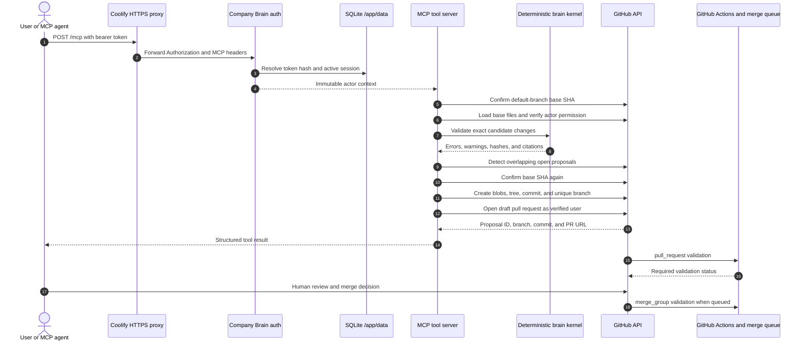

# Superseller Company Brain

This repository is Superseller's Git-native, agent-readable company memory. The active [Open Knowledge Format v0.2](https://github.com/GoogleCloudPlatform/knowledge-catalog/blob/main/okf/SPEC.md) bundle lives in [`brain/`](brain/). The copied [`knowledge/`](knowledge/) bundle is retained as migration evidence and engineering reference; it is not the default context for company-wide or public-content work.

The repository also contains a production-shaped Model Context Protocol (MCP) server. It exposes deterministic read, context, validation, health, and GitHub draft-proposal operations over Streamable HTTP. Markdown and Git remain the source of truth: the server does not add a vector database, dashboard, worker, or second knowledge authority.

## What it does

- Keeps company, people, product, strategy, sales, marketing, event, research, and brand knowledge in reviewable Markdown.
- Separates public facts from internal guidance and marks publication approval explicitly.
- Gives Codex a one-prompt LinkedIn Campaign Studio through the repository-local `create-linkedin-campaign` skill.
- Preserves sources, freshness, ownership, and knowledge gaps instead of hiding uncertainty.
- Gives MCP clients deterministic search, retrieval, bounded context packs, validation, and health data.
- Lets an authorized GitHub user propose exact changes as an isolated draft pull request; it never writes directly to or merges the default branch.
- Stores encrypted GitHub sessions and proposal receipts in local SQLite for a fast, single-container demo.
- Emits redacted, non-blocking Langfuse traces and flushes telemetry during graceful shutdown.

Generated campaign packages appear under `artifacts/campaigns/`. Nothing is published, merged, or sent to another person automatically.

## Start here

1. Read [`brain/index.md`](brain/index.md).
2. Fill the explicit gaps in [`brain/people/team-directory.md`](brain/people/team-directory.md), [`brain/strategy/current-goal.md`](brain/strategy/current-goal.md), and [`brain/events/vibe-coding-summer-jam-session-02.md`](brain/events/vibe-coding-summer-jam-session-02.md).
3. Add the canonical logo described in [`brain/assets/brand-assets.md`](brain/assets/brand-assets.md).
4. Run `make validate` and `npm run check`.
5. Ask Codex: **“Create a LinkedIn campaign for today’s VIBE CODING SUMMER JAM.”**

For the fastest server smoke test, start with [shared-secret local mode](#fast-local-setup-shared-secret). For the complete demo, continue with [GitHub App setup](#github-app-setup) and use `AUTH_MODE=hybrid`.

## Repository map

- [`brain/`](brain/) — active Company Brain and source of truth.
- [`knowledge/`](knowledge/) — legacy product/engineering reference bundle; copied into the runtime image because active concepts cite it.
- [`src/brain/`](src/brain/) — transport-independent parser, deterministic retrieval, context packing, and validation kernel.
- [`src/mcp/`](src/mcp/) — eight MCP tool contracts and adapters.
- [`src/auth/`](src/auth/) and [`src/sessions/`](src/sessions/) — authentication, OAuth/PKCE, encrypted SQLite sessions, and one-time token exchange primitives.
- [`src/github/`](src/github/) — stale-base, conflict, Git Data API, and draft-pull-request proposal workflow.
- [`src/observability/`](src/observability/) — structured redaction, logging, OpenTelemetry, and Langfuse integration.
- [`recipes/`](recipes/) — reusable artifact contracts and workflows.
- [`.agents/skills/`](.agents/skills/) — repository-local Codex workflows.
- [`scripts/`](scripts/) — deterministic validation utilities.
- [`artifacts/`](artifacts/) — generated, review-required outputs.
- [`docs/plans/`](docs/plans/) — architecture notes.

## Architecture

The kernel has no dependency on MCP, GitHub, Express, SQLite, or Langfuse. Adapters supply those boundaries around it. This keeps the Company Brain usable directly from Git and makes the server replaceable.

| Layer          | Responsibility                                                                                                               |
| -------------- | ---------------------------------------------------------------------------------------------------------------------------- |
| `brain/`       | Canonical OKF Markdown, indexes, provenance, publication policy, and governance                                              |
| Brain kernel   | Safe discovery, parsing, deterministic lexical search, bounded context packs, and in-memory candidate validation             |
| HTTP/MCP       | Streamable HTTP transport, per-request identity, stable result envelopes, correlation IDs, and public `/healthz`             |
| Authentication | Constant-time shared-secret checks or GitHub App user-to-server OAuth with state and PKCE S256                               |
| SQLite         | WAL-backed sessions, bearer-token hashes, AES-256-GCM GitHub credentials, OAuth state, exchange codes, and proposal receipts |
| GitHub         | User attribution, repository authorization, isolated branches, commits, draft PRs, checks, and concurrency authority         |
| Langfuse       | Redacted operation traces; failures never change a business-operation result                                                 |
| Coolify        | TLS termination, reverse proxy, one Node.js 22 container, and a persistent `/app/data` volume                                |

### Proposal sequence



GitHub, not a process-local lock, is the concurrency authority. The service checks the requested base against the current default-branch head before validation and again before writing, uses a unique `brain/<actor>/<timestamp>-<slug>-<nonce>` branch, never force-pushes, and rejects overlapping paths in open Company Brain proposals.

## Requirements

- Node.js 22.x and npm from the Node.js distribution.
- Ruby for the original `make validate` and `npm run test:ruby` checks.
- A GitHub App only for GitHub or hybrid authentication and proposal creation.
- A Langfuse project only when telemetry is enabled.
- Docker only for local image testing or Coolify deployment; Docker Compose is not used.

Check the runtime before installing:

```bash
node --version
npm --version
ruby --version
```

The Node version must be `v22.x`.

## Fast local setup: shared secret

Shared-secret mode is the shortest route to read/search/context demos. It needs no GitHub App and no SQLite session database.

```bash
npm ci
export NODE_ENV=development
export BRAIN_ROOT="$PWD/brain"
export MCP_HOST=127.0.0.1
export PORT=3000
export AUTH_MODE=secret
export SECRET_KEY="$(openssl rand -base64 48)"
export ALLOW_SECRET_WRITES=false
export LANGFUSE_ENABLED=false
npm run dev
```

In a second shell, keep the same generated value in a client-only variable:

```bash
export COMPANY_BRAIN_TOKEN='<same-SECRET_KEY-value>'
curl --fail --silent --show-error http://127.0.0.1:3000/healthz
```

Never place the secret in a URL or query parameter. Shared-secret callers are read-only by default. `ALLOW_SECRET_WRITES=true` can mark that actor as write-capable for future policies, but the current `brain_propose_change` tool still requires an individually verified GitHub user and will not let a shared secret impersonate one.

### Local environment file

The application reads process environment variables; it does not silently load a file. To use a local file, copy the template, keep it untracked, and explicitly source it:

```bash
cp .env.example .env.local
chmod 600 .env.local
# Edit .env.local; for a host run use SESSION_DB_PATH=./data/sessions.sqlite.
set -a
. ./.env.local
set +a
npm run dev
```

`.env`, `.env.*`, `data/`, and SQLite files are ignored by Git and excluded from the image. The only exception is the placeholder-only `.env.example`.

### Generate session keys

Generate independent values. Do not reuse one key for another purpose and do not commit or paste the outputs into logs, issues, or this README.

```bash
openssl rand -base64 48  # SECRET_KEY
openssl rand -base64 48  # SESSION_SECRET
openssl rand -base64 32  # SESSION_ENCRYPTION_KEY: exactly 32 random bytes before base64 encoding
```

`SESSION_ENCRYPTION_KEY` also accepts a 64-character hexadecimal encoding of 32 random bytes:

```bash
openssl rand -hex 32
```

For a complete local hybrid run, set `PUBLIC_BASE_URL=http://127.0.0.1:3000`, set `SESSION_DB_PATH=./data/sessions.sqlite`, configure the GitHub variables below, and use `AUTH_MODE=hybrid`.

## Validation and development commands

```bash
make validate              # canonical Ruby Company Brain validation
npm run validate:brain     # TypeScript kernel validation
npm run typecheck
npm run lint
npm test
npm run build
npm run check              # formatting, lint, types, all tests, brain validation, build
```

The CI workflow [`.github/workflows/company-brain-validation.yml`](.github/workflows/company-brain-validation.yml) runs the full gate for both `pull_request` and `merge_group` events on Node.js 22.

## HTTP endpoints

| Method and path              | Authentication           | Purpose                                                                                                 |
| ---------------------------- | ------------------------ | ------------------------------------------------------------------------------------------------------- |
| `GET /healthz`               | Public                   | Minimal liveness/readiness response without secrets or detailed configuration                           |
| `POST`, `GET`, `DELETE /mcp` | Bearer                   | MCP Streamable HTTP messages and SSE subscriptions through the reverse proxy                            |
| `GET /auth/github/login`     | Public                   | Begin GitHub OAuth; optional `return_to` must be a same-origin relative path                            |
| `GET /auth/github/callback`  | GitHub callback          | Validate exact callback, state, and PKCE; establish signed browser session; show one-time exchange code |
| `POST /auth/github/exchange` | One-time code            | Exchange `{ "code": "<one-time-code>" }` for an opaque MCP bearer token                                 |
| `GET /auth/me`               | Browser cookie or bearer | Return the safe authenticated actor, never GitHub credentials                                           |
| `POST /auth/logout`          | Browser cookie or bearer | Revoke the SQLite session and all its MCP bearer tokens; clear the cookie                               |

The exchange response has this shape:

```json
{
  "token_type": "Bearer",
  "access_token": "<opaque-mcp-session-token>",
  "expires_at": "<timestamp>"
}
```

The returned token is a Company Brain MCP session token, not a GitHub access token. GitHub access and refresh tokens remain encrypted in SQLite and are never returned to the browser or MCP client. The callback and exchange responses use no-store behavior; an exchange code is short-lived and can be consumed only once.

## MCP client setup

The production MCP URL is:

```text
https://<your-company-brain-domain>/mcp
```

Authenticate with `Authorization: Bearer <token>`. In shared-secret mode the token is `SECRET_KEY`. In GitHub/hybrid mode it is the opaque token returned by the one-time exchange.

For Codex, keep the token in the environment and reference it from `~/.codex/config.toml`:

```bash
export COMPANY_BRAIN_TOKEN='<opaque-token-or-shared-secret>'
```

```toml
[mcp_servers.superseller_company_brain]
url = "https://brain.example.com/mcp"
bearer_token_env_var = "COMPANY_BRAIN_TOKEN"
```

A generic Streamable HTTP client uses the equivalent configuration:

```json
{
  "mcpServers": {
    "superseller-company-brain": {
      "type": "streamable-http",
      "url": "https://brain.example.com/mcp",
      "headers": {
        "Authorization": "Bearer ${COMPANY_BRAIN_TOKEN}"
      }
    }
  }
}
```

Environment interpolation is client-specific. If a client does not support it, use that client's secret store; do not commit a literal token to its project configuration.

## MCP tools

All eight tools return a stable envelope: `{ "ok": true, "data": ... }` on success or `{ "ok": false, "error": { "category", "message", "correlation_id", "details" } }` on failure. Error responses do not include stacks, absolute host paths, credentials, or raw GitHub responses.

| Tool                   | Main input                                                                                            | Authorization and behavior                                                                                         |
| ---------------------- | ----------------------------------------------------------------------------------------------------- | ------------------------------------------------------------------------------------------------------------------ |
| `brain_search`         | `query`; optional `domains`, `types`, `tags`, `limit` (1–50)                                          | Read. Deterministic ranked concept matches with citations; no embeddings or LLM call.                              |
| `brain_get`            | Exactly one of `concept_id` or safe Brain-relative `path`; optional `heading`                         | Read. Returns one complete concept or bounded heading section.                                                     |
| `brain_context_pack`   | `objective`; optional `domains`, `seed_concept_ids`, `maximum_characters`, `approximate_token_budget` | Read. Deterministic, deduplicated, bounded pack plus citations and selection receipt.                              |
| `brain_list_domains`   | `{}`                                                                                                  | Read. Domain counts, types, owners, and validation summaries.                                                      |
| `brain_validate`       | Optional exact in-memory `changes[]`                                                                  | Read. Validates the current tree or an uncommitted candidate; supports `create`, `update`, `delete`, and `upsert`. |
| `brain_health`         | `{}`                                                                                                  | Read. Non-sensitive kernel/build/GitHub/telemetry status. Unlike `/healthz`, this is an authenticated MCP tool.    |
| `brain_propose_change` | `base_sha`, `title`, `rationale`, exact `changes[]`                                                   | GitHub writer only. Validates, creates a unique branch and commit, then opens a draft PR. Never merges.            |
| `brain_get_proposal`   | Exactly one of `proposal_id` or `pull_request_number`                                                 | Read. Returns attribution, validation, lifecycle, checks, mergeability, and conflict state.                        |

Change objects use a safe POSIX path under the configured Brain root. Proposal changes accept `create`, `update`, or `delete`, exact `content` where applicable, and optional `expected_previous_content_hash` and `expected_blob_sha` preconditions. The proposal base SHA must be the current configured default-branch head; stale bases fail with `STALE_BASE` instead of being silently rebased.

## Authentication modes

| `AUTH_MODE` | Accepted identity                                         | Intended use                                                 |
| ----------- | --------------------------------------------------------- | ------------------------------------------------------------ |
| `secret`    | `Authorization: Bearer <SECRET_KEY>`                      | Fast local/read-only automation demo                         |
| `github`    | GitHub browser login followed by opaque MCP session token | Individually attributed team access                          |
| `hybrid`    | Either shared secret or GitHub session token              | Recommended demo mode: simple reads plus auditable proposals |

Missing or invalid authentication returns `401`. A valid identity without the required repository capability returns `403`. `/healthz` remains public.

### Shared-secret safety

- The comparison uses a fixed-length cryptographic digest and constant-time equality.
- Production rejects a `SECRET_KEY` shorter than 32 characters.
- The secret is accepted only from an Authorization bearer header, never a query parameter.
- Secret actors are read-only unless `ALLOW_SECRET_WRITES=true`; proposal creation still requires GitHub identity.
- Authorization headers and matching secret fields are recursively redacted from logs and telemetry.

### GitHub browser and MCP token flow

1. Open `https://brain.example.com/auth/github/login` in a browser.
2. The server creates a random, expiring OAuth state and PKCE S256 verifier, binds the state to a short-lived signed HttpOnly browser cookie, then redirects to GitHub.
3. GitHub redirects only to the configured `PUBLIC_BASE_URL/auth/github/callback`.
4. The server requires the signed browser-state cookie, verifies state and PKCE, then verifies the GitHub user, App installation repository access, user repository permission, and optional organization/team allowlists.
5. The callback stores encrypted GitHub credentials in SQLite and sets a signed, HttpOnly, SameSite=Lax browser cookie. HTTPS `PUBLIC_BASE_URL` also makes it Secure.
6. The no-store callback page displays a short-lived one-time exchange code.
7. Exchange it once:

   ```bash
   curl --fail --silent --show-error \
     --request POST \
     --header 'Content-Type: application/json' \
     --data '{"code":"<one-time-code>"}' \
     https://brain.example.com/auth/github/exchange
   ```

8. Put the returned opaque bearer in the MCP client's secret store. Logout or expiry invalidates it. Raw GitHub tokens never leave the server.

If an expiring GitHub user token approaches expiry, the proposal path refreshes it and atomically replaces the encrypted credentials. If safe refresh is unavailable or fails after expiry, the session fails closed and the user must log in again.

## GitHub App setup

Create a dedicated GitHub App under the organization or account that owns the Company Brain repository. Do not use a personal access token or a classic OAuth App.

### 1. Register the App

Use these settings, substituting the real public origin:

- **GitHub App name:** a unique Company Brain name.
- **Homepage URL:** `https://brain.example.com/`.
- **User authorization callback URL:** `https://brain.example.com/auth/github/callback`.
- **Webhook:** not required by this implementation; leave it disabled unless another workflow needs it.
- **Where can this GitHub App be installed?** Prefer only the owning account or organization.

`PUBLIC_BASE_URL` should be the external HTTPS origin with no query, fragment, credentials, or proxy-internal hostname. The application constructs the production callback from that explicit value and does not trust forwarded headers for security-sensitive URL generation.

### 2. Grant minimum repository permissions

- Metadata: read.
- Contents: read and write.
- Pull requests: read and write.
- Checks: read, for proposal status.
- Commit statuses: read, for combined commit status.
- Members: read only if `GITHUB_ALLOWED_ORGS` or `GITHUB_ALLOWED_TEAMS` is used.

The App can be read-only if proposal creation is deliberately disabled, but `brain_propose_change` needs both Contents write and Pull requests write. User authorization is intersected with App permissions and installation repository access; an admin user cannot exceed the App's permissions.

### 3. Create credentials and install narrowly

1. Copy the App ID and client ID.
2. Generate a client secret.
3. Generate and securely download an App private key.
4. Install the App and choose **Only select repositories** → the Company Brain repository.
5. Record the numeric installation ID.
6. Set `GITHUB_REPOSITORY=owner/repository` and the actual default branch.

The private key environment value may be a literal multiline PEM or one line with escaped `\n` sequences. Never store the PEM in this repository or Docker build context.

Optional comma-separated allowlists:

```text
GITHUB_ALLOWED_ORGS=organization-one,organization-two
GITHUB_ALLOWED_TEAMS=organization-one/team-slug,organization-two/another-team
```

When configured, allowlist checks fail closed. Team identifiers use `organization/team-slug`.

## Branch protection, validation, and merge queue

The server intentionally does not configure repository protection or merge a proposal. Configure the default branch in GitHub:

1. Require a pull request before merging.
2. Require the Company Brain validation workflow's `validate` job after it has run at least once.
3. Require branches to be up to date or enable GitHub's merge queue according to the team's policy.
4. Block force pushes and branch deletion for the default branch.
5. Keep approval, code-owner, signed-commit, or linear-history rules appropriate to the organization.

The workflow listens to both `pull_request` and `merge_group`. The latter is required for a merge queue to test the synthetic merge group rather than relying only on the PR's last head SHA. If the required check name is not visible in branch settings, open or update a PR once so GitHub registers it.

Every server-created proposal is a draft PR containing actor, base SHA, changed paths, and validation metadata. A human or the repository's existing GitHub policy controls readiness, approval, queueing, and merge.

## Langfuse observability

Enable Langfuse with project-scoped credentials:

```text
LANGFUSE_ENABLED=true
LANGFUSE_PUBLIC_KEY=<placeholder>
LANGFUSE_SECRET_KEY=<placeholder>
LANGFUSE_BASE_URL=https://cloud.langfuse.com
LANGFUSE_ENVIRONMENT=production
LANGFUSE_RELEASE=<image-or-git-release>
```

For a self-hosted instance, set `LANGFUSE_BASE_URL` to its externally reachable API origin. The container needs outbound HTTPS access to it.

A proposal trace is expected to resemble:

```text
mcp.tool.brain_propose_change
├── auth.authenticate
├── auth.github.verify_user
├── auth.github.check_repository_permission
├── brain.validate
├── github.resolve_base
├── proposal.detect_conflicts
├── github.create_commit
├── github.create_branch
└── github.create_pull_request
```

Read tools contain the corresponding `brain.search`, `brain.get`, `brain.select_context`, or `brain.validate` observation. Proposal-status reads include GitHub check/status observations. Token refresh, when needed, appears as `auth.github.refresh_token`.

Telemetry records safe counts, durations, actor/repository identifiers, concept IDs, source paths, result status, and content hashes where useful. Central recursive redaction removes Authorization headers, cookies, secrets, access/refresh/session tokens, OAuth codes and verifiers, private keys, and document/file bodies. Media upload is disabled.

Important limits:

- These traces cover the MCP server's own operations, not the model host's full prompt, hidden reasoning, or generated response.
- Company Brain document bodies and proposed content are omitted by default; a content hash and byte count may be recorded.
- Langfuse export failures are logged safely and never cause a successful MCP operation to be retried or failed.
- `SIGTERM` and `SIGINT` stop new work, close transports and SQLite, force-flush Langfuse, and shut down OpenTelemetry. A forced container kill can still lose the final telemetry batch.

Set `LANGFUSE_ENABLED=false` to disable the integration cleanly.

## Environment reference

Copy [`.env.example`](.env.example) for the complete placeholder list.

| Variable                 | Required      | Meaning                                                                                  |
| ------------------------ | ------------- | ---------------------------------------------------------------------------------------- |
| `BRAIN_ROOT`             | No            | Brain path. Local default `brain`; container default `/app/brain`.                       |
| `MCP_HOST`               | No            | Bind address. Local default `127.0.0.1`; container sets `0.0.0.0`.                       |
| `PORT`                   | Coolify       | Preferred HTTP port; defaults to `3000` and takes precedence over `MCP_PORT`.            |
| `MCP_PORT`               | No            | Local fallback port when `PORT` is absent.                                               |
| `PUBLIC_BASE_URL`        | GitHub/hybrid | Explicit external origin; production GitHub/hybrid mode requires HTTPS.                  |
| `TRUST_PROXY`            | Production    | Express proxy trust. Use `1` for one Coolify proxy hop.                                  |
| `MCP_ALLOWED_HOSTS`      | Recommended   | Comma-separated accepted public hostnames. Defaults from `PUBLIC_BASE_URL` when omitted. |
| `REQUEST_TIMEOUT_MS`     | No            | Request timeout; default `300000`.                                                       |
| `HEADERS_TIMEOUT_MS`     | No            | Header timeout; default `65000`.                                                         |
| `KEEP_ALIVE_TIMEOUT_MS`  | No            | Keep-alive timeout; default `75000`.                                                     |
| `AUTH_MODE`              | Yes           | `secret`, `github`, or recommended demo mode `hybrid`.                                   |
| `SECRET_KEY`             | Secret/hybrid | Shared bearer, at least 32 characters in production.                                     |
| `ALLOW_SECRET_WRITES`    | No            | Defaults `false`; does not confer GitHub identity.                                       |
| `SESSION_SECRET`         | GitHub/hybrid | Independent HMAC secret for signed browser cookies.                                      |
| `SESSION_ENCRYPTION_KEY` | GitHub/hybrid | Independent 32-byte AES-256-GCM key, base64/base64url or 64 hex.                         |
| `SESSION_TTL_SECONDS`    | No            | Browser/MCP session lifetime; default `3600`.                                            |
| `SESSION_DB_PATH`        | GitHub/hybrid | SQLite path; Coolify must use `/app/data/sessions.sqlite`.                               |
| `GITHUB_APP_ID`          | GitHub/hybrid | Numeric GitHub App ID.                                                                   |
| `GITHUB_CLIENT_ID`       | GitHub/hybrid | GitHub App client ID for user OAuth.                                                     |
| `GITHUB_CLIENT_SECRET`   | GitHub/hybrid | GitHub App OAuth client secret.                                                          |
| `GITHUB_APP_PRIVATE_KEY` | GitHub/hybrid | App PEM for installation authentication; literal multiline or escaped `\n`.              |
| `GITHUB_INSTALLATION_ID` | GitHub/hybrid | Numeric installation restricted to the target repository.                                |
| `GITHUB_REPOSITORY`      | GitHub/hybrid | Exact `owner/repository`.                                                                |
| `GITHUB_DEFAULT_BRANCH`  | No            | Protected base branch; default `main`.                                                   |
| `GITHUB_ALLOWED_ORGS`    | No            | Optional comma-separated organization membership allowlist.                              |
| `GITHUB_ALLOWED_TEAMS`   | No            | Optional comma-separated `organization/team-slug` allowlist.                             |
| `LANGFUSE_ENABLED`       | No            | Enables redacted export; defaults disabled in code unless configured.                    |
| `LANGFUSE_PUBLIC_KEY`    | When enabled  | Langfuse project public key.                                                             |
| `LANGFUSE_SECRET_KEY`    | When enabled  | Langfuse project secret key.                                                             |
| `LANGFUSE_BASE_URL`      | No            | Cloud or self-hosted Langfuse API origin.                                                |
| `LANGFUSE_ENVIRONMENT`   | No            | Trace environment, such as `development` or `production`.                                |
| `LANGFUSE_RELEASE`       | No            | Release/image identifier attached to traces.                                             |
| `APP_GIT_SHA`            | No            | Build/revision receipt reported in health; set to the deployed commit SHA.               |

Startup validation names missing variables but never prints their values.

## Docker image

The multi-stage [`Dockerfile`](Dockerfile) uses Node.js 22. The build stage installs the repository's locked npm dependencies, compiles TypeScript, and prunes development dependencies. The runtime image contains only production dependencies, `dist/`, `brain/`, and the referenced `knowledge/` tree. It runs as the non-root `node` user, exposes port 3000, writes only under `/app/data`, and starts with the explicit command `node dist/index.js`.

Build and smoke-test locally without Compose:

```bash
docker build \
  --build-arg APP_GIT_SHA="$(git rev-parse HEAD)" \
  --tag superseller-company-brain:local \
  .

docker volume create superseller-company-brain-data

docker run --rm \
  --name superseller-company-brain \
  --publish 3000:3000 \
  --env-file .env.local \
  --volume superseller-company-brain-data:/app/data \
  superseller-company-brain:local
```

For a local Docker run, ensure `PUBLIC_BASE_URL`, if used, is reachable by the browser and its callback exactly matches the GitHub App. The image health check calls `http://127.0.0.1:${PORT:-3000}/healthz`.

## Coolify deployment

Coolify is the intended production demo target. Deploy one Dockerfile-based resource; do not add Docker Compose, Kubernetes, Redis, PostgreSQL, an external session service, or a second worker.

### Resource settings

1. Create a new Coolify application from this Git repository and select the repository branch to deploy.
2. Choose **Dockerfile** as the build pack and use the repository-root `Dockerfile`.
3. Set the container port to `3000`. Coolify may supply `PORT`; the application respects it and defaults to `3000`.
4. Attach the public HTTPS domain, for example `brain.example.com`.
5. Configure the health check path `/healthz` on port 3000.
6. Add one persistent Docker volume mounted at `/app/data`.
7. Set **exactly one application replica**.
8. Add the environment variables below and deploy.

Prefer a named Docker volume. If a host bind mount is used, its directory must be writable by the image's non-root `node` user; do not solve permission errors by running the application as root.

### Required Coolify values

```text
NODE_ENV=production
MCP_HOST=0.0.0.0
PORT=3000
BRAIN_ROOT=/app/brain
PUBLIC_BASE_URL=https://brain.example.com
TRUST_PROXY=1
MCP_ALLOWED_HOSTS=brain.example.com

AUTH_MODE=hybrid
SECRET_KEY=<generated-secret>
ALLOW_SECRET_WRITES=false
SESSION_SECRET=<independent-generated-secret>
SESSION_ENCRYPTION_KEY=<independent-32-byte-key>
SESSION_TTL_SECONDS=3600
SESSION_DB_PATH=/app/data/sessions.sqlite

GITHUB_APP_ID=<placeholder>
GITHUB_CLIENT_ID=<placeholder>
GITHUB_CLIENT_SECRET=<placeholder>
GITHUB_APP_PRIVATE_KEY=<multiline-or-escaped-pem-placeholder>
GITHUB_INSTALLATION_ID=<placeholder>
GITHUB_REPOSITORY=<owner/repository>
GITHUB_DEFAULT_BRANCH=main

LANGFUSE_ENABLED=true
LANGFUSE_PUBLIC_KEY=<placeholder>
LANGFUSE_SECRET_KEY=<placeholder>
LANGFUSE_BASE_URL=https://cloud.langfuse.com
LANGFUSE_ENVIRONMENT=production
LANGFUSE_RELEASE=<release-placeholder>
APP_GIT_SHA=<deployed-commit-sha>
```

Use Coolify's secret/environment UI. Do not pass secrets as Docker build arguments, bake them into the image, or commit a production env file. After deployment:

```bash
curl --fail --silent --show-error https://brain.example.com/healthz
```

Then verify browser login, `/auth/me`, one-time exchange, MCP initialization, `brain_health`, and a harmless `brain_search` before demonstrating a proposal.

### Why exactly one replica

SQLite WAL safely coordinates the local connections inside one server, and the database persists sessions and proposal receipts across redeployments. It is not a distributed session service. MCP subscription and event state also lives in the application process. Multiple replicas without sticky routing and a shared transport/session design can send a later stream interaction to the wrong process; multiple SQLite writers on separate local volumes would diverge.

Run one replica for this deployment. Before scaling horizontally, replace the session/proposal store with a shared implementation, design distributed MCP session routing, and retest OAuth exchange, revocation, and proposal concurrency. GitHub remains the source of truth for repository concurrency either way.

## Reverse-proxy requirements

Coolify terminates HTTPS and forwards HTTP to the container. Configure or preserve these behaviors:

- Forward the original `Host`, `X-Forwarded-Host`, `X-Forwarded-Proto`, and client address headers.
- Forward `Authorization`, `Mcp-Session-Id`, `Last-Event-ID`, `Accept`, and `Content-Type` unchanged.
- Keep `TRUST_PROXY=1` for exactly one trusted Coolify proxy hop. Do not use an unrestricted trust setting when the container is also directly reachable.
- Do not cache, buffer, compress-transform, or coalesce `text/event-stream` responses. Disable proxy buffering for `/mcp`.
- Allow streaming/chunked responses and flush SSE events immediately.
- Set proxy request/read/idle timeouts at least as high as the application values. The defaults are a 300-second request timeout, 65-second header timeout, and 75-second keep-alive timeout.
- Do not impose an idle timeout shorter than the MCP stream's keep-alive behavior.
- Route all methods used by Streamable HTTP, including `POST`, `GET`, and `DELETE` on `/mcp`.
- Do not rewrite `/mcp` or `/auth/*`, and do not strip response cookies.

Forwarded headers support normal proxy behavior, but OAuth callback generation deliberately uses `PUBLIC_BASE_URL`. A forged forwarded host or protocol must never choose a callback destination. HTTPS in `PUBLIC_BASE_URL` also controls the browser cookie's Secure attribute.

## Persistence and session behavior

`SESSION_DB_PATH=/app/data/sessions.sqlite` is created automatically even when `/app/data` starts empty. SQLite enables WAL mode, foreign keys, and a 5-second busy timeout. The persistent volume must survive image rebuilds and redeployments. The server always admits loopback hostnames in addition to the configured public hostname so the container-local `/healthz` check remains valid without disabling SDK host protection.

Security properties:

- Browser session IDs, MCP bearer tokens, OAuth state, and exchange codes are cryptographically random and opaque.
- Only SHA-256 hashes of MCP bearer tokens, OAuth state, and exchange codes are stored where lookup permits it.
- GitHub access tokens, refresh tokens, and stored PKCE verifiers are encrypted with AES-256-GCM and authenticated record-specific associated data.
- Browser cookies are HMAC signed, HttpOnly, SameSite=Lax, and Secure under an HTTPS public base URL.
- Expired or revoked sessions fail closed. Logout revokes every bearer associated with that browser session.
- Expired/consumed authentication rows are pruned during new auth writes; login and exchange also have bounded per-client and global process-local limits.
- Proposal receipts contain workflow metadata, not GitHub credentials.

The database is not full-disk encryption: actor identifiers, timestamps, and proposal metadata remain visible to someone who can read the volume. Protect and back up the volume accordingly. Losing or rotating `SESSION_ENCRYPTION_KEY` makes existing encrypted GitHub sessions unreadable and requires users to log in again. Rotating `SESSION_SECRET` invalidates browser cookies; rotating `SECRET_KEY` invalidates shared-secret clients.

## Security and concurrency model

- **Knowledge boundary:** `brain/` is canonical. Legacy claims are not public truth until curated into the Brain with current provenance and publication metadata.
- **Path boundary:** all retrieval and proposed paths are normalized beneath the configured Brain root; traversal, unsafe POSIX paths, symlink escapes, and writes outside that root fail closed.
- **Identity boundary:** actor, login, repository, organization, and permission fields come from authentication and GitHub APIs, never MCP tool arguments.
- **Permission boundary:** effective access is the intersection of App permissions, App installation repository access, user repository permission, and optional organization/team membership.
- **Change boundary:** an MCP proposal contains exact content and preconditions, validates entirely before remote writes, and can only create an isolated draft PR.
- **Concurrency boundary:** current default-branch SHA, expected content/blob hashes, unique non-force branch refs, open-PR overlap detection, and GitHub branch rules prevent silent overwrite.
- **Merge boundary:** there is no merge tool. GitHub protection, required checks, reviewers, and the merge queue control merges.
- **Secret boundary:** secrets are runtime environment values, excluded from the image, redacted centrally, encrypted or hashed at rest where appropriate, and never returned as MCP data.
- **Observability boundary:** Langfuse is advisory. A telemetry outage cannot cause a GitHub or MCP business operation to repeat.

## Troubleshooting

| Symptom                                 | Checks and resolution                                                                                                                                                                                   |
| --------------------------------------- | ------------------------------------------------------------------------------------------------------------------------------------------------------------------------------------------------------- |
| Container is unhealthy                  | Confirm Coolify routes to the actual `PORT`, `MCP_HOST=0.0.0.0`, `/healthz` is not protected, and startup configuration has no missing required variable.                                               |
| `SQLITE_CANTOPEN` or read-only database | Confirm `/app/data` is mounted, persistent, and writable by the non-root `node` user. Check that `SESSION_DB_PATH` is exactly `/app/data/sessions.sqlite`.                                              |
| Sessions disappear after redeploy       | The volume is absent, mounted at the wrong path, or attached to a replaced resource. Restore a persistent `/app/data` volume and keep one replica.                                                      |
| OAuth callback mismatch                 | Match the GitHub App callback exactly to `<PUBLIC_BASE_URL>/auth/github/callback`. Use the public HTTPS origin, not a container hostname, preview URL, forwarded host, or trailing path prefix.         |
| Login succeeds but `/auth/me` is `401`  | Check browser cookie acceptance, HTTPS/`PUBLIC_BASE_URL`, `SESSION_SECRET` stability, session expiry, and persistent SQLite.                                                                            |
| Exchange returns `401`                  | The code is wrong, expired, already consumed, or its session was revoked. Restart browser login; never reuse a code.                                                                                    |
| MCP returns `401`                       | Send `Authorization: Bearer ...`; ensure the client did not put it in a query string. GitHub session tokens expire and logout revokes them.                                                             |
| MCP returns `403`                       | Verify user repository read/write permission, selected-repository App installation, App Contents/PR permissions, and configured org/team membership. Shared secrets cannot create attributed proposals. |
| `STALE_BASE`                            | Fetch the current default-branch SHA, rebuild/revalidate the exact changes, and submit a new proposal. The service deliberately does not rebase silently.                                               |
| `GIT_CONFLICT`                          | Inspect the reported path and other open `brain/` draft PRs. Resolve or close the overlapping proposal, then start from the latest base.                                                                |
| `GITHUB_UNAVAILABLE`                    | Check App ID, private-key newline handling, installation ID, selected repository, client credentials, outbound HTTPS, GitHub availability, and API rate limits.                                         |
| Proposal status lacks checks            | Grant Checks read and Commit statuses read, ensure Actions ran for the PR head, and verify the installation covers the repository.                                                                      |
| MCP stream disconnects or hangs         | Disable reverse-proxy buffering/caching for `/mcp`, preserve SSE/MCP headers, allow `GET`/`POST`/`DELETE`, and increase proxy idle/read timeouts.                                                       |
| No Langfuse trace                       | Check `LANGFUSE_ENABLED`, both project keys, base URL, outbound connectivity, environment/release filters, and shutdown grace time. MCP should continue even when export fails.                         |
| Merge queue check is missing            | Ensure the workflow is on the default branch, includes `merge_group`, and the required validation job has run once so it can be selected in branch rules.                                               |
| Local native dependency install fails   | Use Node.js 22. Install platform build prerequisites for `better-sqlite3`, or use the Docker build stage, which includes Python, Make, and a C++ compiler.                                              |

## Production hardening beyond the demo

Before treating this as a high-availability service:

- Move sessions, exchange state, proposal receipts, and MCP transport coordination to a shared, audited store before adding replicas.
- Tune the built-in single-process login/exchange limits for expected traffic and add proxy-level limits for callback and MCP requests before broader exposure.
- Put all secrets in Coolify's secret store or an external secret manager; define rotation and forced-reauthorization procedures.
- Back up `/app/data`, test restore, monitor disk growth, and define retention/cleanup for long-lived proposal receipts; expired and consumed authentication rows are pruned automatically during auth writes.
- Pin or attest release images, scan dependencies and images, generate an SBOM, and keep Node 22 security releases current.
- Restrict container ingress to the Coolify proxy and restrict outbound traffic to GitHub and the configured Langfuse endpoint where practical.
- Apply GitHub branch/ruleset protection, least-privilege App installation, required reviewers, and organization audit-log retention.
- Review organization/team allowlists and remove departed users promptly; revoke the App or its user grants during incident response.
- Add operational metrics and alerts for authentication failures, SQLite errors, GitHub rate limits, proposal failures, stream disconnects, and telemetry backlog without logging secrets or document bodies.
- Define privacy, deletion, and data-retention rules for both the Company Brain and observability metadata. Never store credentials, customer PII, private messages, or sensitive infrastructure access details in `brain/`.
- Run threat modeling and penetration testing for OAuth, proxy trust, session fixation/replay, CSRF, request size, path handling, GitHub permission drift, and denial of service.

## Safety boundary

Do not put credentials, private customer data, private messages, private LinkedIn data, or sensitive infrastructure access details in the Company Brain. Metadata is a retrieval policy, not encryption or repository access control. For public artifacts, follow [`brain/governance/publication-policy.md`](brain/governance/publication-policy.md) and fail closed on unsupported claims.
